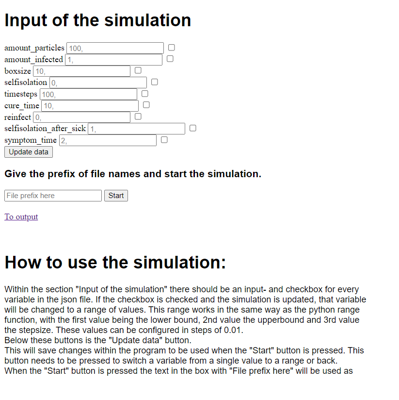

# Simulation runner.
Noud Hover

Screencast: https://youtu.be/-H-tpbuEt-s

### Quick description
This project is a tool that can be used to remotely run a simulation in bulk. \
It allows the user to choose sets of initial conditions based on the json file that is loaded and runs the simulation based on that. \
Afterwards the results will be available on the output page. \
This project is also meant to be used by only the person running the server. And as such the site is minimal in design.\

### How to use:
#### Install the docker image: noud333/project

To host this image you run the following command:

`sudo docker run -p 5000:5000
 -v "$(pwd)"/run:/app/run 
 noud333/project 
 infection.py
 infection.json`

 Where the **-p** line couples local_port : port_hosted_site\
 The **-v** line couples your own folder to the run folder in the container. The "$(pwd)" part needs to remain after that the folder where your own files are located can be written.\
 Then we get the **name of the image**.\
 After which the **name of the python program**. And lastly the **json file that corresponds to the python program. (these 2 programs do not need to be file paths. Just the names. The files themselves need to be in the folder that you link in the -v term)

 A few examples of very simple "simulations" that can be run with this can be found in the app/run folder of this github page. 

### The main site

On the picture above the main page of the site can be seen. It can change variables for every entry in the json file. If these variables are set to range mode with the checkbox multiple json files will be made for it. On the bottom is a small explanation of the controls.

 #### Side notes
 In case the simulation takes a while to load the main page will "crash" after the start button is pressed. This however is not a problem. The process is still working in the background and the user can just refresh the page and find the results trickle into the output page.

 In the run folder of this github page there is a simulation named "Infection" this is an old python program of mine (made before this minor) and therefore does not follow the styleguide. But as this program was a tool to test my project that should not matter.